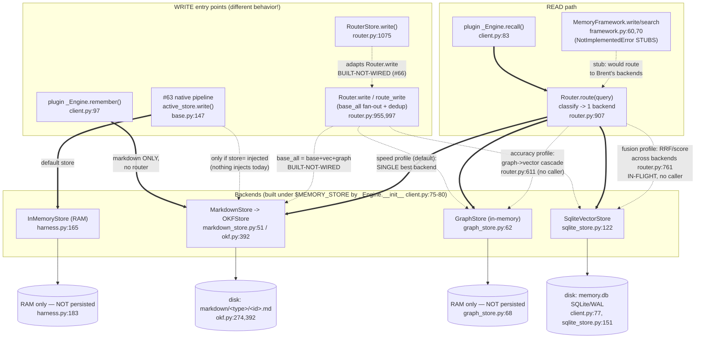

# Storage & Retrieval Map — agent-memory-harness (Brent's P3: stores + router)

> ⚠️ **HISTORICAL SNAPSHOT — STATUS TAGS SUPERSEDED (drawn pre-#76).** Do NOT rely on the
> LIVE / BUILT-NOT-WIRED / IN-FLIGHT tags below. **Authoritative current state = `DECISION_LOG.md`
> (D025, D034–D038) + `CONTEXT.md`.** What changed since this map:
> - The plugin is now a **dumb client of `contract.build_store`**, which returns a **`RouterStore` over
>   `Router.with_config(...)`** (#76 / ADR-harness-011). So **`_Engine.remember` ROUTES writes through
>   `RouterStore.write` → `Router.write`** (dedup + `base_all` fan-out to markdown+vectors+graph) — **NOT
>   markdown-only** — and `recall` → `route().search`. RouterStore (#66/D025), fusion (#68), reranker (#67)
>   are all **merged**.
> - The graph store gained a **`path=` SQLite durability seam (#92/D035)**, **delete across all backends
>   (#93/D036)**, an **e2e CRUD test across all 3 durable backends (#95/D037)**, and **`delete` is now on
>   the `MemoryStore` protocol (#99 + #101/D038)**. The durability→delete→e2e arc is merged.
> - **The ONE thing below still true:** the *live plugin's* `GraphStore` is built **without** `path=`
>   (`contract.py:97`), so the plugin's graph is in-RAM until Keith's one-line `build_store` graph-path
>   change lands — that is the only remaining "not-live" item. `MemoryFramework` is also still a stub, but
>   the live plugin/bench path bypasses it (uses `build_store`).
>
> The data-flow SHAPES below remain a useful reference; the per-node STATUS tags are the dated snapshot.
>
> _(original header) Verified against real code on branch `router/fusion-profiles`; `file:line` citations._

## Legend

| Mark | Meaning |
|------|---------|
| **LIVE** | Wired and runs on a real path today (a production caller actually reaches it). |
| **BUILT-NOT-WIRED** | Code exists and is tested, but nothing on a production path calls it. |
| **DEFAULT / offline** | The zero-dependency stdlib path you get with no injection (offline embedder, RAM store, rule classifier). |
| **IN-FLIGHT** | On a branch / behind a profile nothing selects yet (fusion). |
| `==>` | LIVE edge.  `..>` | dormant / not-wired edge. |

---

## The one fact (CORRECTED — current as of #76 / #92 / #99 / #101)

The write path now goes **through the router**. `contract.build_store()` returns a `RouterStore` over a
configured `Router`, and the plugin drives it:

1. **Plugin `_Engine.remember`** — **LIVE**, routes through **`RouterStore.write` → `Router.write`**
   (dedup + `base_all` fan-out to markdown+vectors+graph). NOT markdown-only anymore.
   (`client.py` `remember` → `self._store.write`; `contract.py:99`)
2. **#63 native pipeline** (`store.write`) — a `RouterStore` runs end-to-end **when injected**
   (`store=RouterStore`, D025); the bare default is still `InMemoryStore`.
3. **`Router.write` / `route_write`** (base_all + dedup) — **LIVE** via RouterStore on the plugin path.
4. **`RouterStore`** (#66) — **LIVE**: it's what `build_store` returns; the plugin + dreaming consume it.

So the plugin's `remember` DOES land routed, deduped, multi-index writes. The remaining gap is durability
of the *plugin's graph specifically*: its `GraphStore` is built without `path=` (`contract.py:97`), so its
nodes are in-RAM until the `build_store` graph-path line lands (Keith). The vectors + markdown backends
already persist; the graph store *can* (the `path=` seam, #92) — it just isn't wired in the plugin yet.

The **read** path was always routed: plugin `recall()` -> `Router.route(query)` -> one backend's
`.search()` (or the cascade/fusion view per the auto-selected profile).

---

## Mermaid



---

## ASCII fallback

```
================================ WRITE PATHS ================================
                            (four entries, DIFFERENT behavior)

(LIVE) plugin _Engine.remember()  client.py:97
        |  markdown ONLY, NO router, NO fan-out
        v
   [MarkdownStore] --> OKFStore.write --> disk: markdown/<type>/<id>.md
                                           (okf.py:274,392)

(LIVE) #63 native  active_store.write()  base.py:147
        |  default store =
        v
   [InMemoryStore] --> RAM only, nothing persisted   (agent.py:639, harness.py:183)
        :
        :....(only if store= injected; NOTHING injects today)...> real backends

(BUILT-NOT-WIRED) Router.write / route_write   router.py:955,997
        :  policy base_all = markdown + vectors + graph  (+ optional dedup, default OFF)
        :........> [MarkdownStore] + [SqliteVectorStore] + [GraphStore]
                   (no production caller -> dead code)

(BUILT-NOT-WIRED) RouterStore.write()   router.py:1075   (PR #66)
        :  adapts Router.write to the MemoryStore seam so a store-typed slot
        :  (plugin _Engine / MemoryFramework / #63 store=) could drive the fan-out
        :........> Router.write  (referenced only in router.py + 1 test)

(STUB) MemoryFramework.write/search/get/all  framework.py:60-77
        X raise NotImplementedError  (Keith's scaffold — not implemented)

================================ READ PATH =================================

(LIVE) plugin _Engine.recall()  client.py:83
        |
        v
   Router.route(query)   router.py:907   -- classify() picks ONE backend --
        |
        |  speed profile (DEFAULT = RouterConfig(), what _Engine uses):
        |     graph-intent  -> GraphStore
        |     concept/why   -> SqliteVectorStore
        |     literal/code  -> MarkdownStore
        |        then .search(query, k, as_of)  -> ranked Hits  (client.py:84)
        |
        :  accuracy profile (cascade ON): GRAPH query -> _GraphVectorCascade
        :     graph stage + exact-anchor gate -> project via vectors  router.py:611
        :     (BUILT-NOT-WIRED: needs accuracy_profile(); no production caller)
        |
        :  fusion profile: _FusionRetriever fans out to ALL backends,
        :     merges by RRF or score-norm  router.py:761
        :     (IN-FLIGHT on branch router/fusion-profiles; no production caller)
```

---

## Physical-storage table — where the bytes actually live

All paths are under **`$MEMORY_STORE`** (resolved from the `store=` arg or the
`MEMORY_STORE` env var; default in docs is `${CLAUDE_PROJECT_DIR}/.cookbook-memory`,
but **the code applies NO default** — unset `MEMORY_STORE` -> `store_path=None` ->
client is inactive / fail-open). `config.py:46-48`, `client.py:152-157`.

| Backend | Constructed at | Physical location | Persisted? | Notes |
|---------|----------------|-------------------|-----------|-------|
| **vectors** (`SqliteVectorStore`) | `client.py:77` -> `root/"memory.db"` | **`$MEMORY_STORE/memory.db`** (SQLite, WAL mode enforced) | YES (disk) | one `items` row per memory; vector stored as JSON text column. `sqlite_store.py:151,158` |
| **markdown** (`MarkdownStore` -> `OKFStore`) | `client.py:78` -> `root/"markdown"` | **`$MEMORY_STORE/markdown/<type-slug>/<id-slug>.md`** | YES (disk) | one OKF concept doc per memory (YAML frontmatter + body). `index.md`/`log.md` only on explicit `sync`. `okf.py:274,392-396` |
| **graph** (`GraphStore`) | `client.py:79` -> `GraphStore()` (no path) | **RAM only** | **NO** | nodes + OKF-link adjacency in dicts; gone on process exit. `graph_store.py:62-68` |
| **events** (`EventStream`) | `config.py:48` | **`$MEMORY_STORE/events.jsonl`** | YES (append) | structured recall/remember/error events (ADR-harness-007). `config.py:17` |
| **InMemoryStore** (#63 default) | `agent.py:639` | **RAM only** | **NO** | the native eval's default `store=`; BM25 over a dict. `harness.py:183` |

---

## Status summary per path

> **Snapshot table (pre-#76) — the Status column is STALE.** Current state is the corrected "one fact"
> section above + DECISION_LOG D034–D038: `_Engine.remember` is now LIVE *through RouterStore* (routed +
> base_all fan-out); `Router.write` / `RouterStore` / fusion are **merged & live**; the graph has a `path=`
> SQLite durability seam (#92) and `delete` is on the `MemoryStore` protocol (#99/#101). The only remaining
> not-live item is the plugin's graph `path=` wiring (Keith).

| Path | Status | Hits which backend(s) |
|------|--------|-----------------------|
| `_Engine.remember` (plugin write) | **LIVE — routes through RouterStore** (#76) | markdown+vectors+graph (base_all fan-out + dedup) |
| `_Engine.recall` -> `Router.route` (plugin read) | **LIVE** | one backend (or cascade/fusion per the auto-selected profile) |
| #63 native `active_store.write` | **LIVE** | `RouterStore` when injected (D025); bare default still `InMemoryStore` (RAM) |
| `Router.route_write` / `Router.write` base_all + dedup | **LIVE** (via RouterStore on the plugin path) | markdown+vectors+graph |
| `RouterStore` (store-seam adapter, #66) | **LIVE** (what `build_store` returns; plugin + dreaming consume it) | drives `Router.write` |
| `MemoryFramework.{write,get,search,all,delete}` | **STUB** (`NotImplementedError`) — but the live path BYPASSES it (uses `build_store`) | none (`framework.py`) |
| `_GraphVectorCascade` (accuracy read) | **LIVE** under the accuracy profile (auto-selected when `VOYAGE_API_KEY` set, #76) | graph->vector |
| `_FusionRetriever` (fusion read, RRF/score) | **MERGED** (#68); LIVE under the fusion profile (default offline auto-select) | all backends fused |
| dedup-on-write | **OFF by default** (unsafe offline, D024) | n/a (`router.py:478`) |
