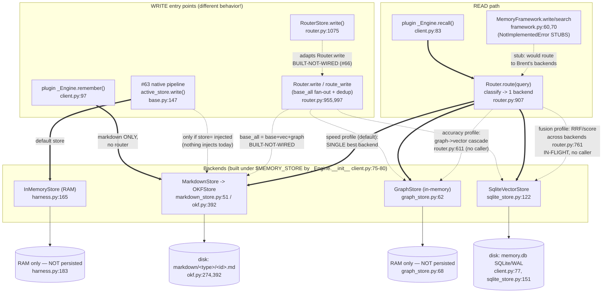

# Storage & Retrieval Map — agent-memory-harness (Brent's P3: stores + router)

> ⚠️ **PARTIALLY SUPERSEDED (as of D030 — re-verify before relying on per-node status).** This map was
> drawn earlier; since then: **RouterStore merged (#66)**, **reranker (#67)**, **fusion profile (#68)**,
> **graph eval Step 0 (#75)**, **graph Step 1 typed/directional (#81)** all shipped. So the lines below
> reading "RouterStore built-not-wired", "fusion in-flight", and "graph untyped/undirected" are STALE —
> see DECISION_LOG **D025–D030** for current state. **Still accurate (the load-bearing point):** the LIVE
> plugin write path (`_Engine.remember`) + `MemoryFramework` still **bypass RouterStore/Router.write** —
> routed write-routing/dedup are not wired into the product path yet (the Keith integration). The
> read/write data-flow shapes below remain a useful reference; the per-node "status" tags are dated.
>
> _(original header) Verified against real code on branch `router/fusion-profiles`; `file:line` citations._

## Legend

| Mark | Meaning |
|------|---------|
| **LIVE** | Wired and runs on a real path today (a production caller actually reaches it). |
| **BUILT-NOT-WIRED** | Code exists and is tested, but nothing on a production path calls it. |
| **DEFAULT / offline** | The zero-dependency stdlib path you get with no injection (offline embedder, RAM store, rule classifier). |
| **IN-FLIGHT** | On a branch / behind a profile nothing selects yet (fusion). |
| `==>` | LIVE edge.  `..>` | dormant / not-wired edge. |

---

## The one fact that resolves the confusion

There are **four write entry points and they do NOT behave the same**:

1. **Plugin `_Engine.remember`** — **LIVE**, but writes to **markdown ONLY**. It does
   *not* go through the router and does *not* fan out. (`client.py:97-109`)
2. **#63 native pipeline** (`active_store.write(...)`) — **LIVE**, but the default
   store is **`InMemoryStore` (RAM, nothing persisted)**. It only touches Brent's real
   backends if a store is *injected* via `store=` — and nothing injects one today.
   (`base.py:147-148`, `agent.py:639`)
3. **`Router.write` / `route_write`** (base_all fan-out + dedup) — **BUILT-NOT-WIRED**.
   The full markdown+vectors+graph fan-out logic exists and is tested, but the Router
   isn't a `MemoryStore`, so no seam drives it. (`router.py:955-1040`)
4. **`RouterStore`** — the adapter (PR #66) that makes #3 usable through a store seam —
   **BUILT-NOT-WIRED**. Referenced only in `router.py` + one test; zero production
   callers. (`router.py:1043-1112`)

So today: the only write that lands real persisted bytes through a *routed* path is...
**none of them via the router.** Plugin remember = markdown file. Native eval =
RAM. The router's fan-out write is dead code awaiting a `RouterStore` wiring.

The **read** path is different and the one place the router IS live: plugin
`recall()` -> `Router.route(query)` -> ONE backend's `.search()`.

---

## Mermaid



---

## ASCII fallback

```
================================ WRITE PATHS ================================
                            (four entries, DIFFERENT behavior)

(LIVE) plugin _Engine.remember()  client.py:97
        |  markdown ONLY, NO router, NO fan-out
        v
   [MarkdownStore] --> OKFStore.write --> disk: markdown/<type>/<id>.md
                                           (okf.py:274,392)

(LIVE) #63 native  active_store.write()  base.py:147
        |  default store =
        v
   [InMemoryStore] --> RAM only, nothing persisted   (agent.py:639, harness.py:183)
        :
        :....(only if store= injected; NOTHING injects today)...> real backends

(BUILT-NOT-WIRED) Router.write / route_write   router.py:955,997
        :  policy base_all = markdown + vectors + graph  (+ optional dedup, default OFF)
        :........> [MarkdownStore] + [SqliteVectorStore] + [GraphStore]
                   (no production caller -> dead code)

(BUILT-NOT-WIRED) RouterStore.write()   router.py:1075   (PR #66)
        :  adapts Router.write to the MemoryStore seam so a store-typed slot
        :  (plugin _Engine / MemoryFramework / #63 store=) could drive the fan-out
        :........> Router.write  (referenced only in router.py + 1 test)

(STUB) MemoryFramework.write/search/get/all  framework.py:60-77
        X raise NotImplementedError  (Keith's scaffold — not implemented)

================================ READ PATH =================================

(LIVE) plugin _Engine.recall()  client.py:83
        |
        v
   Router.route(query)   router.py:907   -- classify() picks ONE backend --
        |
        |  speed profile (DEFAULT = RouterConfig(), what _Engine uses):
        |     graph-intent  -> GraphStore
        |     concept/why   -> SqliteVectorStore
        |     literal/code  -> MarkdownStore
        |        then .search(query, k, as_of)  -> ranked Hits  (client.py:84)
        |
        :  accuracy profile (cascade ON): GRAPH query -> _GraphVectorCascade
        :     graph stage + exact-anchor gate -> project via vectors  router.py:611
        :     (BUILT-NOT-WIRED: needs accuracy_profile(); no production caller)
        |
        :  fusion profile: _FusionRetriever fans out to ALL backends,
        :     merges by RRF or score-norm  router.py:761
        :     (IN-FLIGHT on branch router/fusion-profiles; no production caller)
```

---

## Physical-storage table — where the bytes actually live

All paths are under **`$MEMORY_STORE`** (resolved from the `store=` arg or the
`MEMORY_STORE` env var; default in docs is `${CLAUDE_PROJECT_DIR}/.cookbook-memory`,
but **the code applies NO default** — unset `MEMORY_STORE` -> `store_path=None` ->
client is inactive / fail-open). `config.py:46-48`, `client.py:152-157`.

| Backend | Constructed at | Physical location | Persisted? | Notes |
|---------|----------------|-------------------|-----------|-------|
| **vectors** (`SqliteVectorStore`) | `client.py:77` -> `root/"memory.db"` | **`$MEMORY_STORE/memory.db`** (SQLite, WAL mode enforced) | YES (disk) | one `items` row per memory; vector stored as JSON text column. `sqlite_store.py:151,158` |
| **markdown** (`MarkdownStore` -> `OKFStore`) | `client.py:78` -> `root/"markdown"` | **`$MEMORY_STORE/markdown/<type-slug>/<id-slug>.md`** | YES (disk) | one OKF concept doc per memory (YAML frontmatter + body). `index.md`/`log.md` only on explicit `sync`. `okf.py:274,392-396` |
| **graph** (`GraphStore`) | `client.py:79` -> `GraphStore()` (no path) | **RAM only** | **NO** | nodes + OKF-link adjacency in dicts; gone on process exit. `graph_store.py:62-68` |
| **events** (`EventStream`) | `config.py:48` | **`$MEMORY_STORE/events.jsonl`** | YES (append) | structured recall/remember/error events (ADR-harness-007). `config.py:17` |
| **InMemoryStore** (#63 default) | `agent.py:639` | **RAM only** | **NO** | the native eval's default `store=`; BM25 over a dict. `harness.py:183` |

---

## Status summary per path

| Path | Status | Hits which backend(s) |
|------|--------|-----------------------|
| `_Engine.remember` (plugin write) | **LIVE** | markdown only (`client.py:102`) |
| `_Engine.recall` -> `Router.route` (plugin read) | **LIVE** | exactly one (speed profile) (`client.py:84`) |
| #63 native `active_store.write` | **LIVE** | `InMemoryStore` (RAM) unless `store=` injected (`base.py:147`, `agent.py:639`) |
| `Router.route_write` / `Router.write` base_all + dedup | **BUILT-NOT-WIRED** | markdown+vectors+graph (`router.py:981-1020`) |
| `RouterStore` (store-seam adapter, #66) | **BUILT-NOT-WIRED** | drives `Router.write` (`router.py:1043`) |
| `MemoryFramework.{write,get,search,all}` | **STUB** (`NotImplementedError`) | none (`framework.py:60-77`) |
| `_GraphVectorCascade` (accuracy read) | **BUILT-NOT-WIRED** | graph->vector (`router.py:611`) |
| `_FusionRetriever` (fusion read, RRF/score) | **IN-FLIGHT** (branch) | all backends fused (`router.py:761`) |
| dedup-on-write | **OFF by default** (unsafe offline, D024) | n/a (`router.py:478`) |
