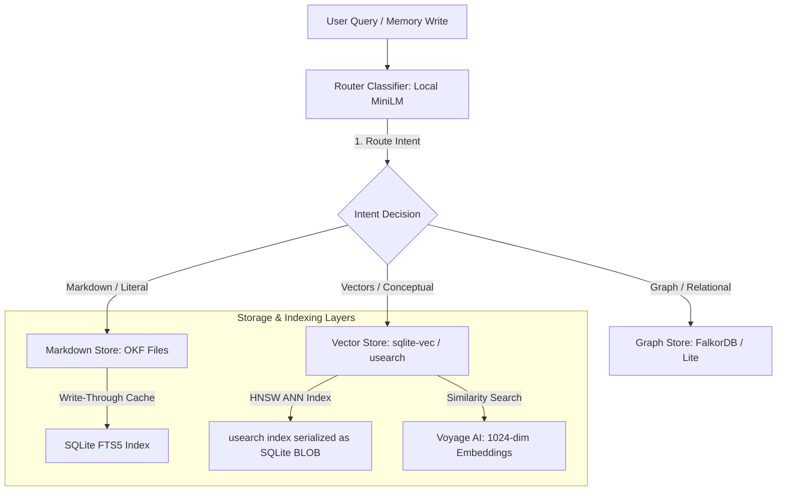

> **⚠️ STATUS: CANDIDATE-UPGRADE ROADMAP — UNDER EVALUATION (reframed 2026-06-23).** External research-agent
> draft. A cross-vendor accuracy review (3 researchers on claude/codex/antigravity + a Codex adjudicator)
> pressure-tested it. **Important:** that review was briefed with stdlib-only / in-process as hard constraints
> — an over-statement. The corrected lens: **stdlib-offline is the TEST FLOOR, not a feature ceiling**; these
> recommendations are **candidate upgrades to evaluate eval-first**, not constraint-rejected. Design risks to
> engineer around (from the review): **Rec 2 (FalkorDB)** — needs Python ≥3.12 (bumpable) + an embedded
> `redis-server` (fine for a feature backend; the stdlib in-memory `GraphStore` stays the test floor); it
> speaks Redis not Bolt, so it's a **NEW backend** (`FalkorGraphStore` + its own tests) that must
> `MATCH`-never-`MERGE` to avoid re-introducing D041's bug. **Rec 3 (usearch-in-BLOB)** — concurrency hazard,
> needs an index-coherence design; trivial ANN-SQL ordering bug. **Rec 4 (FTS5)** — diverges from the shared
> `idf_coverage` scorer; FTS5-as-SSOT also addresses durability. **Rec 1 (MiniLM)** — the no-LLM-routing
> principle is already built; MiniLM-as-an-option is an eval question. **Not yet adopted, not rejected —
> pending eval.** Full review (a risk-map) → `docs/router_recommendations_cross_vendor_review.md`. Decisions →
> `DECISION_LOG.md` **D044** (reopens D043/D039).
>
> *(Original research-agent content preserved verbatim below.)*

---

# Router Architecture Recommendations: The High-Performance Hybrid Blueprint

This document synthesizes the recommendations for your **`router.py`** architecture, combining intent classification, vector search, graph databases, and lexical indexing into a single, high-performance local-first memory pipeline.

---

## 1. Architectural Blueprint Overview

The core goal of the memory router is to manage *where* memories are stored and *how* they are retrieved, optimizing for:
1. **Low Latency:** Under $50\text{ms}$ CPU overhead per query.
2. **Low API Cost:** Reserving cloud API calls strictly for vector database operations.
3. **Local Developer Portability:** Allowing the entire test suite and database to run offline with zero-dependency setups.



---

## 2. Core Recommendations

### Recommendation 1: Hybrid Classification & Search Pipeline (MiniLM + Voyage AI)
Do not use generative LLMs (like Claude) for routing classification. Instead, implement a **Coexistence Model** where a small local model handles routing intent, and the frontier model handles database indexing.

* **Routing Classification (MiniLM):** Use a local, few-shot sentence transformer model (such as `MiniLM`) to embed user queries and memory contents. Compare these embeddings against your exemplars (`DEFAULT_ROUTING_EXEMPLARS`) locally on CPU in under $10\text{ms}$.
* **Database Search (Voyage AI):** If and only if the router decides to query or write to the `vectors` backend, call the Voyage AI API to get the 1024-dimensional embedding.
* **Why:** This saves significant Voyage API billing and network latency for all queries routed to `graph` or `markdown`, while maintaining high-dimensional Voyage accuracy when vector search is required.

---

### Recommendation 2: FalkorDB (via `falkordblite`) for Graph Storage
Replace Neo4j with **FalkorDB** for the graph storage engine.

* **GraphBLAS Traversal:** FalkorDB represents graphs as sparse matrices and runs traversals as linear algebra operations. This provides predictable sub-millisecond multi-hop BFS traversals.
* **Embedded Testing:** By using the **`falkordblite`** package, you can spin up an embedded, self-contained database in Python during local unit tests. This allows you to replace your current mocked `FakeBoltDriver` with a real database engine in [test_neo4j_parity.py](file:///home/brent-gibson/projects/agent-memory-harness/eval/memeval/stores/tests/test_neo4j_parity.py) without requiring docker setups.
* **Low Footprint:** Unlike Neo4j, which runs on the JVM and requires pre-allocating heaps, FalkorDB is C-based and runs in-memory with near-zero resource overhead.

---

### Recommendation 3: Local Vector Indexing (usearch + SQLite BLOB)
Replace the Python-side brute-force cosine similarity loop in [sqlite_store.py](file:///home/brent-gibson/projects/agent-memory-harness/eval/memeval/stores/sqlite_store.py) with a hybrid **`usearch` + SQLite** structure.

* **In-Memory HNSW Indexing:** Use `usearch` (a lightweight, header-only C++ HNSW implementation) to perform sub-millisecond approximate nearest neighbor searches.
* **Single-File Durability:** Instead of managing separate index files on disk, serialize the `usearch` index directly into a SQLite `BLOB` column using Python's `io.BytesIO`. This keeps your vector store fully self-contained inside a single `.db` file.
* **Two-Stage Filtering:** Implement a two-stage query pipeline:
  1. **Vector Stage:** Query the in-memory `usearch` index to fetch the top $N$ nearest candidate IDs (e.g. $N=50$).
  2. **Metadata Stage:** Run a standard SQL query over those candidate IDs to filter by tags, version, or `as_of` temporal constraints:
     ```sql
     SELECT item_id, content, timestamp FROM items 
     WHERE item_id IN ($candidate_ids) AND timestamp <= $as_of 
     ORDER BY relevancy DESC LIMIT $k;
     ```

---

### Recommendation 4: Markdown FTS5 Write-Through Cache
Avoid scanning the disk or running tokenization/BM25 scoring inside Python for your `MarkdownStore`.

* **SQLite FTS5:** SQLite's built-in Full-Text Search 5 virtual table runs tokenization, inverted indexing, and Okapi BM25 natively in C. It requires **zero new dependencies** as it is part of Python's standard `sqlite3` library.
* **Write-Through Pattern:**
  * **On Write:** Write the `.md` file to disk to preserve the Open Knowledge Format (OKF) directory layout, and write the text into the FTS5 virtual table.
  * **On Startup:** The FTS5 index is persistent on disk; do not scan the directories.
  * **On Search:** Query the FTS5 table to find matching document IDs ranked by BM25 in C. Then, load only the top-$k$ files from disk.

---

## 3. Implementation Roadmap

```
[Phase 1: Local Lexical & Intent Boost]
  - Integrate SQLite FTS5 write-through cache in MarkdownStore.
  - Implement local MiniLM intent classification for Router.classify().
  
[Phase 2: Graph Store Migration]
  - Replace Neo4jGraphStore with FalkorGraphStore.
  - Swap test_neo4j_parity.py to use falkordblite (removing FakeBoltDriver).

[Phase 3: Vector Indexing Scaling]
  - Replace brute-force python cosine loops with sqlite-vec (for small datasets)
    or usearch serialized SQLite BLOBs (for large datasets).
```
